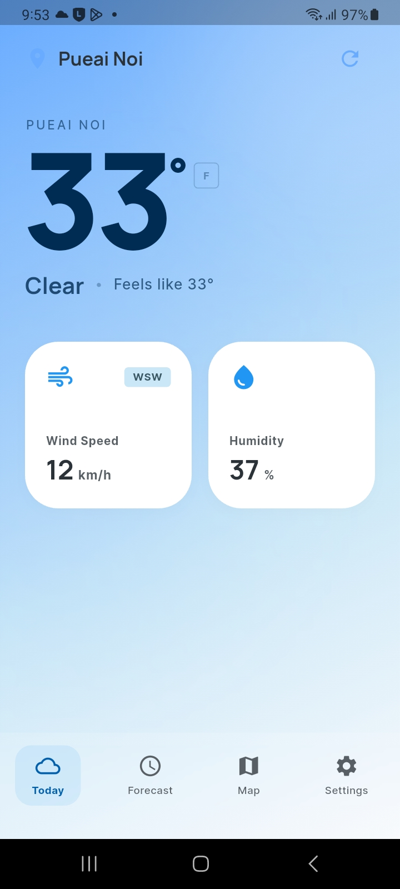
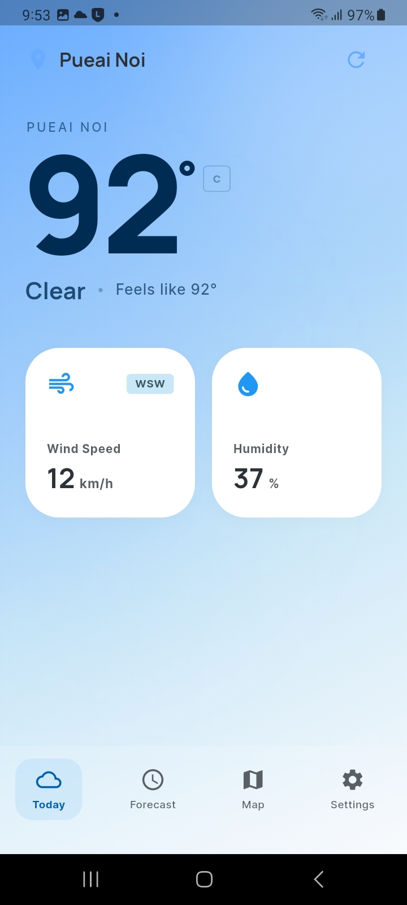

# SoHot Weather App

SoHot is a minimalist, "glance-and-go" mobile weather application designed to provide immediate access to essential local weather conditions without the clutter of traditional weather apps.

## 🚀 Overview

The app focuses on three core data points: **Location**, **Temperature**, and **"Feels Like"** conditions. It uses high-contrast typography and an ethereal design language to communicate weather status through both data and visual mood.

| Celsius Display | Fahrenheit Display |
| :---: | :---: |
|  |  |

> **Note:** These screenshots were captured from a test run on an **Android 13 (API 33)** device.

### Key Features
- **Real-time Weather Integration:** Powered by OpenWeatherMap API for accurate, up-to-the-minute data.
- **Active Geolocation:** Automatically detects your current location to show local conditions.
- **Minimalist Dashboard:** Zero secondary navigation; 100% focused UI.
- **Interactive Unit Toggle:** Seamlessly switch between Celsius (°C) and Fahrenheit (°F) with persistent user preference.
- **Glassmorphic Bento Grid:** Quick access to Wind Speed (km/h), Humidity, and Wind Direction (Cardinal).
- **Ethereal Visuals:** Soft gradient backgrounds and atmospheric blurs that reflect current conditions.

## 🛠 Tech Stack

- **Framework:** [Flutter](https://flutter.dev/)
- **Language:** [Dart](https://dart.dev/)
- **API Integration:** OpenWeatherMap API (Current Weather)
- **Geolocation:** [Geolocator](https://pub.dev/packages/geolocator)
- **Persistence:** [Shared Preferences](https://pub.dev/packages/shared_preferences)
- **Environment Management:** [Flutter Dotenv](https://pub.dev/packages/flutter_dotenv)
- **Typography:** [Google Fonts](https://pub.dev/packages/google_fonts) (Manrope & Inter)
- **Version Management:** [FVM](https://fvm.app/) (Flutter Version Management)

## 📁 Project Structure

```text
climate/
├── PRD.md            # Product Requirements Document
├── README.md         # Project Overview (Updated)
├── .env              # API Key storage (Excluded from Git)
└── so_hot/           # Core Flutter Application
    ├── lib/
    │   ├── main.dart # UI Logic & State Management
    │   ├── models/   # Data models (WeatherModel)
    │   └── services/ # API & Location Services
    └── pubspec.yaml  # Dependencies & Config
```

## 🏃 Getting Started

### Prerequisites
- Flutter SDK installed
- [FVM](https://fvm.app/) installed (Required for this project)
- OpenWeatherMap API Key

### Configuration

1. **API Key Setup:**
   Create a `.env` file in the root directory (and ensure a copy exists in `so_hot/`) with your API key:
   ```text
   OPENWEATHERMAP_API_KEY="your_api_key_here"
   ```

### Installation & Execution

1. **Navigate to the app directory:**
   ```bash
   cd so_hot
   ```

2. **Install dependencies:**
   ```bash
   fvm flutter pub get
   ```

3. **Run the application:**
   ```bash
   fvm flutter run
   ```

## 📈 Current Status (Phase 2 - Integrated)

- [x] Responsive layout & Custom Theme
- [x] Real-time Weather API integration (OpenWeatherMap)
- [x] Active Geolocation (Auto-detecting user location)
- [x] Unit conversion with persistence (C/F)
- [x] Glassmorphic UI components with live data
- [x] Error handling and loading states

---
*Created by Stitch (Design Partner) & Team.*
